

  

  

  

  

  <picture>
    <source media="(prefers-color-scheme: dark)"  srcset="assets/images/architecture-principles-dark.svg">
    <source media="(prefers-color-scheme: light)" srcset="assets/images/architecture-principles-light.svg">
    
  </picture>

  

<!-- Both SVGs are self-hosted and displayed side-by-side:
     - GitHub Metrics is generated server-side by .github/workflows/metrics.yml
     - Top Languages is generated weekly by .github/workflows/top-languages.yml
     Viewing this profile makes no external network requests.
     TODO: Revisit introducing live GitHub stats cards once a self-hosted or
     privacy-safe alternative is identified; the vercel.app endpoints below
     make external requests on every page load and could be a vector for
     tracking or malicious redirects.
     ! [GitHub Stats] (https://github-readme-stats.vercel.app/ api?username=chaoscommencer&show_icons=true&theme=tokyonight&hide_border=true&count_private=true)
     ! [Top Languages] (https://github-readme-stats.vercel.app/ api/top-langs/?username=chaoscommencer&layout=compact&theme=tokyonight&hide_border=true) -->

  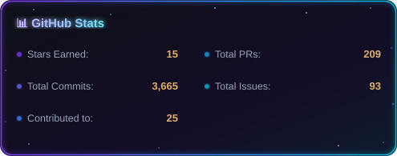
  &nbsp;
  

<!--START_SECTION:contribution-graph-->

  <picture>
    <source media="(prefers-color-scheme: dark)" srcset="assets/images/github-contribution-fire-dark.svg">
    <source media="(prefers-color-scheme: light)" srcset="assets/images/github-contribution-fire.svg">
    
  </picture>

<!--END_SECTION:contribution-graph-->

<!--START_SECTION:activity-->

  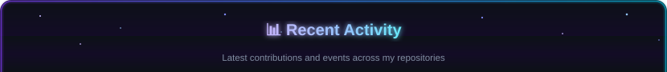
  
  
  
  
  
  

<!--END_SECTION:activity-->

  

<!--START_SECTION:lets-connect-->

  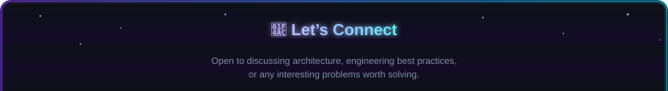
  <a href="https://github.com/chaoscommencer"></a>
  

<!--END_SECTION:lets-connect-->
